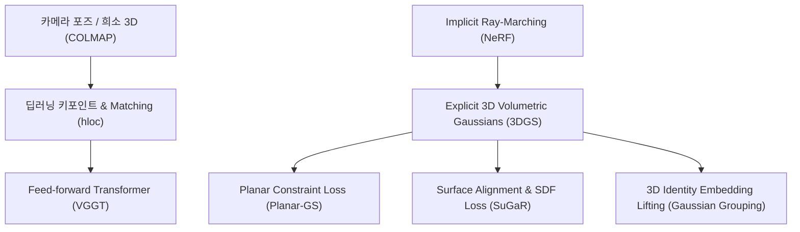

# 3D Reconstruction 기초 지식 가이드 (3D Reconstruction Fundamentals)

본 문서는 프로젝트 내 포함된 다양한 3D Reconstruction 서드파티 기술들(COLMAP, hloc, VGGT, 3DGS, Planar-GS, SuGaR, Gaussian Grouping)의 수학적 원리, 핵심 개념, 발전 방향 및 SLAM과의 비교 분석을 다룹니다.

---

## 1. 개요 및 패러다임 변화 (Overview & Paradigm Shift)

3D Reconstruction 연구는 2D 이미지 집합으로부터 3D 공간 구조 및 카메라 포즈를 복원하고, 이를 고품질로 시각화 및 구조화하는 방향으로 발전해 왔습니다.

주요 발전 단계:

1. **SfM & Pose Estimation**: 고전적 기하학(COLMAP) $\rightarrow$ 딥러닝 기반 특징 매칭(hloc) $\rightarrow$ Feed-forward Transformer(VGGT)
2. **Scene Representation**: Implicit Ray-Marching(NeRF) $\rightarrow$ Explicit Volumetric Rasterization(3DGS)
3. **Geometric Regularization**: 무제한 가우시안 구름 $\rightarrow$ 평면 제약(Planar-GS) 및 표면 정렬 SDF(SuGaR)를 통한 Polygon Mesh 추출
4. **Semantic Understanding**: 단순 렌더링 $\rightarrow$ 3D 공간 내 개별 객체 인스턴스 분리(Gaussian Grouping)

---

## 2. 카메라 포즈 및 3D 점구름 추정 (SfM & Pose Estimation)

### 2.1 COLMAP (고전적 Structure-from-Motion)

COLMAP은 고전 미분기하학 및 Multi-View Geometry 이론에 기반한 오프라인 SfM 파이프라인입니다.

- **SIFT 특징점 추출 및 디스크립터 매칭**: 이미지의 스케일 공간(Scale-space)에서 DoG(Difference of Gaussians)를 이용해 불변 특징점을 추출합니다.
- **에피폴라 기하학 (Epipolar Geometry)**: 두 뷰 간의 대응점 $x_1, x_2$에 대해 에피폴라 구속 조건을 적용합니다.
  $$x_2^T E x_1 = 0 \quad \text{또는} \quad x_2^T F x_1 = 0$$
  - $E$: 본질 행렬 (Essential Matrix, 카메라 내부 파라미터가 교정된 경우)
  - $F$: 기초 행렬 (Fundamental Matrix, 미교정 카메라의 경우)
- **RANSAC 및 삼각측량**: 이상치(Outlier)를 제거하기 위해 RANSAC을 수행하고, 교차하는 광선을 역투영하여 3D 점의 위치를 삼각측량(Triangulation)합니다.
- **Bundle Adjustment**: 모든 카메라 포즈 $P_j$와 3D 점 $X_i$에 대해 재투영 오차(Reprojection Error)를 최소화합니다.
  $$\min_{P_j, X_i} \sum_{i,j} \rho \left( \| x_{ij} - \pi(P_j, X_i) \|^2 \right)$$
  Levenberg-Marquardt 알고리즘을 사용해 최적화합니다.

### 2.2 hloc (Hierarchical Localization)

고전적 SIFT는 텍스처가 부족한 벽, 반사면, 급격한 조명 변화나 대폭의 시점 변화 환경에서 매칭에 실패하는 한계가 있습니다. hloc은 이를 딥러닝 기반으로 해결합니다.

- **SuperPoint**: CNN 신경망을 통해 이미지 전체에서 고밀도 키포인트와 특징 디스크립터를 동시 추출합니다.
- **SuperGlue**: 키포인트 집합을 그래프의 노드로 정의하고, Graph Neural Network (GNN)와 Self/Cross Attention 메커니즘을 통해 노드 간 관계를 인코딩합니다.
- **Optimal Transport (Sinkhorn Algorithm)**: 매칭 행렬 최적화 문제를 수학적 최적 수송(Optimal Transport)으로 정화하여 Sinkhorn 알고리즘으로 이중 확률 행렬(Doubly Stochastic Matrix)을 구해 매칭 모호성을 극복합니다.

### 2.3 VGGT (Visual Geometry Grounded Transformer)

- **Feed-forward Visual Transformer**: 반복적인 Bundle Adjustment 또는 키포인트 매칭 절차 없이, Multi-view 이미지 집합을 입력받아 Attention 메커니즘을 통해 엔드투엔드(End-to-End)로 3D Geometry를 예측합니다.
- **특징**: 단 한 번의 Feed-forward 추론만으로 카메라 포즈, Depth Map, Point Map을 직접 출력하므로 초고속 초기화가 가능합니다.

---

## 3. 3D 공간 표현 및 렌더링 (3D Scene Representation & Rendering)

### 3.1 3D Gaussian Splatting (3DGS)

NeRF는 Implicit MLP 네트워크를 향해 광선을 쏘아 수백 번 표본 추출(Ray Marching)을 해야 하므로 렌더링 속도가 매우 느렸습니다. 3DGS는 이를 명시적 볼륨(Explicit Volumetric) 표현으로 전환하여 해결했습니다.

- **3D 가우시안 방정식**: 3D 공간상의 한 점 $x$에서의 가우시안 분포는 다음과 같습니다.
  $$G(x) = \exp\left(-\frac{1}{2}(x-\mu)^T \Sigma^{-1} (x-\mu)\right)$$
  - $\mu \in \mathbb{R}^3$: 가우시안의 중심 위치
  - $\Sigma \in \mathbb{R}^{3 \times 3}$: 공분산 행렬
- **공분산 행렬 분해 (Positive Semi-Definite)**:
  공분산 행렬 $\Sigma$는 수치적 안정성을 위해 회전 행렬 $R$과 3차원 스케일 행렬 $S$로 분해하여 관리합니다.
  $$\Sigma = R S S^T R^T$$
  - $R$: 쿼터니언 $q = (r, x, y, z)$로부터 유도된 $3 \times 3$ 회전 행렬
  - $S$: 스케일 벡터 $s = (s_x, s_y, s_z)$로 구성된 대각 행렬 $\text{diag}(s)$
- **Differentiable Tile-based Rasterization**:
  2D 화면의 타일 단위로 가우시안들을 정렬한 후, Front-to-Back 순서로 $\alpha$-blending 렌더링을 수행합니다.
  $$C = \sum_{i \in N} c_i \alpha_i \prod_{j=1}^{i-1} (1 - \alpha_j)$$
  CUDA 하드웨어 병렬화를 통해 100+ FPS 이상의 실시간 포토리얼리스틱 렌더링을 달성합니다.

---

## 4. 기하학적 제약 및 메시 추출 (Geometric Regularization & Mesh Extraction)

3DGS는 렌더링 손실함수(L1 + D-SSIM)만으로 최적화되므로, 시각적으로는 완벽해 보여도 3D 공간상에 가우시안들이 허공에 떠 있거나 렌더링 방향에 의존적인 **Geometry Ambiguity**가 발생합니다.

### 4.1 Planar-GS (Planar Regularized 3DGS)

- **문제점**: 밋밋한 벽, 바닥 등 텍스처가 부족한 평면 영역에서 가우시안들이 3D 공간상에 구름 형태로 무작위 분산되어 노이즈가 생깁니다.
- **수학적 제약 (Planar Normal Regularization)**:
  가우시안의 최소 주축 방향(Normal Vector $n_i$)을 추정 평면의 법선 $N$과 일치시키는 제약 손실 함수를 추가합니다.
  $$\mathcal{L}_{\text{planar}} = \sum_{i} \left( 1 - | n_i \cdot N | \right)$$
  이를 통해 3D 가우시안들을 평면 모양(thin disk)으로 평평하게 압착시켜 구멍 없는 평면 구조를 복원합니다.

### 4.2 SuGaR (Surface-Aligned Gaussian Regularization)

- **문제점**: 3DGS는 볼륨 표현이므로 Poisson Surface Reconstruction 같은 고전 기법을 적용하면 메시 표면이 왜곡되고 지저분해집니다.
- **Surface Alignment Regularization**:
  가우시안 중심 $\mu$가 최단 3D 표면에 정확히 위치하도록 가우시안의 밀도 분포와 Signed Distance Function (SDF) $d(x)$를 정렬하는 손실 함수를 도입합니다.
- **Polygon Mesh 추출**:
  표면에 정밀하게 밀착된 가우시안 포인트들로부터 Poisson Surface Reconstruction 및 Marching Cubes 알고리즘을 적용하여 3D 시각화 도구(Blender, Unity 등)에서 활용 가능한 OBJ 메시 파일 형태로 변환합니다.

---

## 5. 의미론적 3D 공간 이해 (Semantic Understanding)

### 5.1 Gaussian Grouping

- **파라미터 확장**:
  각 3D 가우시안에 기존 요소(위치 $\mu$, 색상 $c$, 불투명도 $\alpha$, 공분산 $\Sigma$) 외에 추가로 **$n$차원 Identity Embedding Vector ($f_i \in \mathbb{R}^d$)**를 정의합니다.
- **3D Lifting & Contrastive Loss**:
  2D SAM(Segment Anything Model) 마스크 정보를 3D 공간으로 역투영하여 렌더링된 2D 임베딩 맵과 2D 마스크 간의 Contrastive Loss를 최적화합니다.
- **응용**: 동일 객체에 속한 가우시안들이 3D 임베딩 공간상에서 클러스터링되므로, 3D 공간 내 개별 객체(예: 의자, 테이블)를 자유롭게 3D 분리, 삭제, 이동, 텍스처 교체할 수 있습니다.

---

## 6. SLAM vs COLMAP (SfM) 비교 분석

| 항목 | SLAM (예: ORB-SLAM3, VINS-Mono) | COLMAP (Structure-from-Motion) |
| --- | --- | --- |
| **처리 방식** | **실시간 스트리밍 (Online / Real-time)** | **오프라인 일괄 처리 (Offline / Batch)** |
| **주요 목적** | 이동체의 현재 위치 추정(Localization) 및 지도 작성 | 전체 데이터셋에 대한 고정밀 3D 구조 복원 |
| **입력 형태** | 연속 비디오 프레임 + IMU/센서 데이터 | 수집 완료된 정적 이미지 전체 집합 |
| **최적화 범위** | Local Sliding Window / Keyframe BA + Loop Closure | 전체 씬에 대한 대규모 Global Bundle Adjustment |
| **연산 제약** | 프레임 레이트 내 완료 필수 (실시간성) | 연산 시간 제약 없음 |

### 주요 결론

- **공통점**: 에피폴라 기하학, 특징점 매칭, 삼각측량, Bundle Adjustment(Levenberg-Marquardt)라는 수학적 기하학 파이프라인은 완전히 동일합니다.
- **차이점**: SLAM은 로봇/AR의 실시간 탐색을 위한 제약 기반 알고리즘이며, COLMAP은 시간 제약 없이 최상의 3D 정밀도를 얻는 오프라인 복원 소프트웨어입니다.
- **3DGS와의 관계**: 3DGS나 NeRF의 학습을 위한 초기 카메라 포즈 설정에는 높은 정밀도가 필수적이므로 오프라인 파이프라인인 COLMAP 또는 hloc이 표준으로 활용됩니다.
